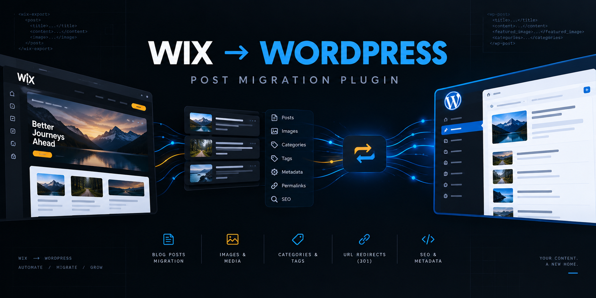
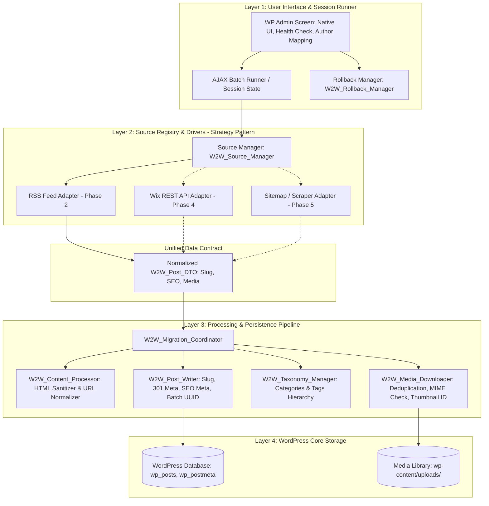

# Wix to WordPress Post Migrator

<p align="center">
  
</p>

<p align="center">
  
  
  
  
  
</p>

---

## 📌 Overview

**Wix to WordPress Post Migrator** is an enterprise-grade, extensible, and standards-compliant WordPress plugin engineered to seamlessly migrate blog posts, media assets, categories, tags, and SEO metadata from **Wix** into **WordPress**.

Built strictly in accordance with **WordPress.org Coding Standards (WPCS)** and **SOLID OOP principles**, the plugin decouples data extraction from WordPress persistence. It delivers a resilient, high-performance migration pipeline with chunked background batching, intelligent media deduplication, full-resolution asset fetching, and comprehensive SEO preservation.

---

## 🚀 Key Highlights & Architecture

### 🧩 1. Open-Closed Strategy Architecture
* **Strategy & Factory Pattern**: Source drivers implement the contract `W2W_Source_Adapter_Interface` managed by `W2W_Source_Manager`.
* **Multi-Source Support**:
  * **RSS Feed Driver (MVP)**: Zero-auth, fast XML parsing.
  * **Wix REST API Driver**: Deep synchronization with drafts, rich text structures, and custom collections.
  * **Sitemap / HTML Scraper Driver**: Fallback scraping for sites with disabled feeds and API restrictions.
* **Strict DTO Standard**: Incoming post data is mapped into a strongly-typed `W2W_Post_DTO` (PHP 7.4+ type safety), ensuring the core pipeline is fully source-agnostic.

### 🖼️ 2. Intelligent Media Engine
* **Full-Resolution Image Restoration**: Wix CDN dynamically transforms image URLs with lossy parameters (e.g. `/v1/fill/w_800,h_600,...`). The content processor uses regex filtering to strip compression parameters and fetch original uncompressed high-resolution images (`...static.wixstatic.com/media/xyz~mv2.jpg`).
* **Hash-Based Media Deduplication**: Tracks files via MD5 checksums and `_w2w_source_media_url` post meta. Reusable banners, avatars, and icons are mapped to existing WordPress attachments instead of bloating `wp-content/uploads/`.
* **Featured Image Assignment**: Automatically designates the post thumbnail (`_thumbnail_id`) from RSS `<enclosure>`, `<media:content>`, or the first body image.
* **MIME & Upload Security**: Every downloaded file is validated against permitted WordPress MIME types using `wp_check_filetype_and_ext()`.

### 🔍 3. SEO Preservation & 301 Redirect Mapping
* **Slug Preservation**: Preserves original URL slugs directly into `wp_posts.post_name` to maintain search index continuity.
* **Meta Field Synchronization**: Automatically integrates with industry-standard SEO plugins:
  * **Yoast SEO**: `_yoast_wpseo_title`, `_yoast_wpseo_metadesc`
  * **Rank Math**: `rank_math_title`, `rank_math_description`
  * **All in One SEO**: `_aioseo_title`, `_aioseo_description`
* **1-Click 301 Redirect Map Export**: Stores the original Wix URL (`_w2w_original_url`) and generates exportable rules for `.htaccess` / Nginx as well as CSV import files for the **Redirection** plugin.

### 🧹 4. Deep Content Sanitization
* **Wix Artifact Purging**: Strips proprietary markup including `data-mesh-id`, `data-testid`, fixed container constraints (`width: 980px`), and empty spacer tags (`<p>&nbsp;</p>`).
* **Embed Normalization**: Converts Wix iframe embeds (YouTube, Vimeo, SoundCloud) into responsive WordPress/Gutenberg blocks.

### 🛡️ 5. Fault Tolerance, Resumption & Rollback
* **AJAX Chunked Queue**: Imports 2–3 posts per request with real-time UI logging and progress tracking, eliminating PHP execution timeout risks.
* **Session Persistence & Resume**: Stores migration states in `_w2w_migration_session`. Interruptions or closed browser tabs can be resumed with a single click.
* **Batch UUID Rollback (`_w2w_batch_id`)**: Every migration run tags created posts, terms, and attachments with a unique batch identifier, allowing administrators to safely purge test imports in one click without affecting existing content.
* **Pre-Flight System Check**: Automatically inspects server requirements (PHP version, cURL, GD/Imagick, uploads write permissions, memory limits, and SSRF URL validation).

### 🎨 6. Native WordPress UI & Asset Pipeline
* **Zero Bloat / No External CSS Frameworks**: Built entirely using native WordPress Admin styles (`.wrap`, `.button-primary`, `.form-table`, `.notice`, `.wp-list-table`).
* **Sass Preprocessing (`.sass`)**: Written strictly in indented **`.sass`** syntax (not `.scss`) with full variable isolation (`src/sass/_variables.sass`) compiled into `admin/css/admin.css`.
* **Modern JavaScript**: Modular client scripts compiled via bundler into optimized `admin/js/admin.js`.

---

## 🏛️ System Architecture



---

## 📂 Project Directory Structure

```text
wix-to-wp-plugin/
├── docs/
│   └── PROJECT_PLAN.md              # Complete architecture plan, OOP design, WPCS & QA protocol
├── github-banner-wix-to-wp.png      # Project visual banner
├── package.json                     # NPM build scripts for Sass (.sass) and JS compilation
├── readme.txt                       # Official WordPress.org repository description
├── uninstall.php                    # Database and options cleanup on uninstall
├── wix-to-wp-migrator.php           # Main plugin entry point & constant definitions
│
├── src/                             # Uncompiled frontend sources
│   ├── sass/                        # Stylesheets (strictly indented .sass)
│   │   ├── _variables.sass          # Color tokens, typography, and spacing variables
│   │   └── admin.sass               # Master admin stylesheet
│   └── js/                          # Modular JavaScript
│       ├── admin.js                 # Frontend orchestration entry point
│       └── modules/                 # Sub-modules (AJAX queue, progress bar, rollback)
│
├── languages/                       # Internationalization & gettext files (.pot)
│   └── wix-to-wp-migrator.pot
│
├── includes/                        # Core backend codebase (PSR-4 / WPCS Autoloaded)
│   ├── class-plugin.php             # Plugin lifecycle orchestrator (Singleton)
│   ├── class-autoloader.php         # Standards-compliant class autoloader
│   │
│   ├── dto/
│   │   └── class-post-dto.php       # Strongly typed post data transfer object
│   │
│   ├── interfaces/
│   │   └── interface-source-adapter.php # Source adapter contract
│   │
│   ├── sources/                     # Source adapters
│   │   ├── class-source-manager.php # Factory and registry for data sources
│   │   ├── class-source-rss.php     # RSS Feed ingestion adapter (Phase 2)
│   │   ├── class-source-api.php     # Wix REST API ingestion adapter (Phase 4)
│   │   └── class-source-sitemap.php # HTML / Sitemap scraper adapter (Phase 5)
│   │
│   ├── engine/                      # Processing & migration pipeline
│   │   ├── class-migration-coordinator.php # Orchestrates step execution
│   │   ├── class-content-processor.php     # Wix HTML cleaning & URL un-shortening
│   │   ├── class-media-downloader.php      # Image downloading, MIME validation, deduplication
│   │   ├── class-taxonomy-manager.php      # Category & tag hierarchy resolution
│   │   ├── class-post-writer.php           # Post writing, slug preservation, meta storage
│   │   └── class-rollback-manager.php      # 1-click batch purge & rollback handler
│   │
│   ├── utils/                       # Supporting utilities
│   │   ├── class-logger.php            # Migration event logger
│   │   ├── class-environment-check.php # System pre-flight inspection (cURL, GD, SSRF)
│   │   └── class-seo-handler.php       # Meta field mapping for Yoast, Rank Math, AIOSEO
│   │
│   └── ajax/
│       └── class-ajax-handler.php      # Secure AJAX controller (Nonces & Capabilities)
│
├── admin/                           # Production admin assets & view templates
│   ├── class-admin.php              # Menu registration and asset enqueuing
│   ├── views/
│   │   ├── main-page.php            # Main tabbed administration view
│   │   ├── tab-rss.php              # RSS configuration form, author mapping, health check
│   │   ├── preview-table.php        # Interactive post preview with selection checkboxes
│   │   ├── progress-bar.php         # Real-time progress bar and log stream
│   │   └── modal-rollback.php       # Rollback confirmation modal
│   ├── css/
│   │   └── admin.css                # Compiled production CSS
│   └── js/
│       └── admin.js                 # Compiled production JavaScript bundle
│
└── tests/                           # Automated test suite and iteration audit logs
    ├── bootstrap.php                # Test harness & WordPress function stubs
    ├── run-tests.php                # CLI test runner
    ├── unit/                        # Unit tests
    │   ├── test-post-dto.php
    │   ├── test-content-processor.php
    │   ├── test-media-importer.php
    │   ├── test-seo-handler.php
    │   ├── test-rollback.php
    │   ├── test-source-rss.php
    │   └── test-post-writer.php
    └── reports/                     # Iteration verification markdown reports
        ├── iteration-1-foundation.md
        ├── iteration-2-rss-mvp.md
        └── ...
```

---

## 🗺️ Development Roadmap

| Phase | Milestone | Scope | Deliverables & Artifacts |
|---|---|---|---|
| **Phase 1** | **Architectural Foundation & Pipeline** | Core WPCS plugin skeleton, strict DTO, autoloader, services (content cleaner, media deduplicator, post writer, rollback manager, environment checker), Sass/JS compiler, and test suite. | `tests/reports/iteration-1-foundation.md` |
| **Phase 2** | **RSS Adapter MVP & Native Admin UI** | `W2W_Source_RSS`, pre-flight health check, author mapping dropdown, post preview table, chunked AJAX batching, real-time progress bar, rollback UI, and 301 redirect map generation. | `tests/reports/iteration-2-rss-mvp.md` |
| **Phase 3** | **Hardening & v1.0 Release** | Real-world feed edge cases (broken images, special characters, server timeouts, recovery), `readme.txt` compliance, `uninstall.php` cleanup routine. | `tests/reports/iteration-3-release-v1.md` |
| **Phase 4** | **Wix REST API Driver** | `W2W_Source_API`, Wix Blog API v3 integration, OAuth/API Key authentication, rich-text conversion into Gutenberg/HTML blocks. | `tests/reports/iteration-4-api-adapter.md` |
| **Phase 5** | **Sitemap / HTML Scraper Driver** | `W2W_Source_Sitemap`, automated sitemap parsing, DOM scraping fallback for feeds without RSS or API access. | `tests/reports/iteration-5-scraper.md` |

---

## 💻 Tech Stack & Requirements

* **WordPress**: 5.8 or higher (tested up to latest)
* **PHP**: >= 7.4 (PHP 8.0, 8.1, 8.2 and 8.3 fully supported)
* **PHP Extensions**: `curl`, `simplexml`, `mbstring`, `gd` or `imagick`
* **Frontend Styles**: Sass (strictly `.sass` indented syntax) compiled to standard CSS
* **Admin UI**: Native WordPress Admin UI Components (No external CSS frameworks)
* **Testing**: Standalone PHP CLI Test Runner & Unit Test Suite

---

## 🛠️ Build & Development Commands

```bash
# Install frontend build dependencies
npm install

# Compile Sass (.sass) and bundle JavaScript for production
npm run build

# Watch mode for automatic compilation during development
npm run dev

# Run the automated PHP unit test suite
php tests/run-tests.php
```

---

## 📄 License & Standards

This project is licensed under the **GNU General Public License v2.0 or later (GPLv2+)**.  
Built strictly adhering to the **[WordPress Coding Standards (WPCS)](https://developer.wordpress.org/coding-standards/wordpress-coding-standards/)**.
